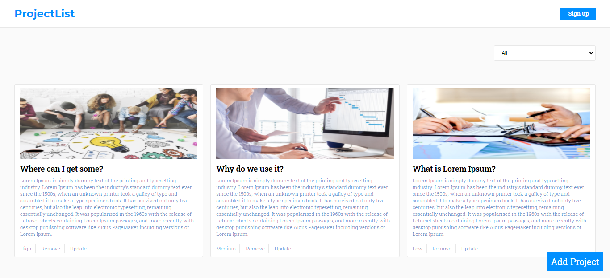

# ProjectList

- This is simple CRUD React & Redux application.You can create,update,delete your projects and also filter them by their priority.

### Main page

## Live Demo

- [Live](https://crud-projects.netlify.app/)

## Main Features

- Create,Update and Delete a project.
- Details page about the project info.

## Built with

- TypeScript
- React
- Redux
- SCSS
- Jest

## Getting Started

- Clone the repo `git@github.com:Murodjon000/CRUD-React-project.git`
- cd `into` the project
- Run `git pull origin app`
- Run `yarn install` or `npm install` to install dependencies
- On the terminal run `npm run start` open up the live server
- To run tests write `npm run test` or `yarn test` on the terminal

## Author

👤 **Murodjon Tursunpulatov**

- Github: [@murodjon000](https://github.com/murodjon000)
- Twitter: [@MurodjonTursun5](https://twitter.com/MurodjonTursun5)
- Linkedin: [@Murodjon Tursunpulatov](https://www.linkedin.com/in/murodjon-tursunpulatov-5189481b3/)

## 🤝 Contributing

Contributions, issues and feature requests are welcome!

Feel free to check the [issues page](issues/).

## Show your support

Give a ⭐️ if you like this project!

## 📝 License

MIT License
